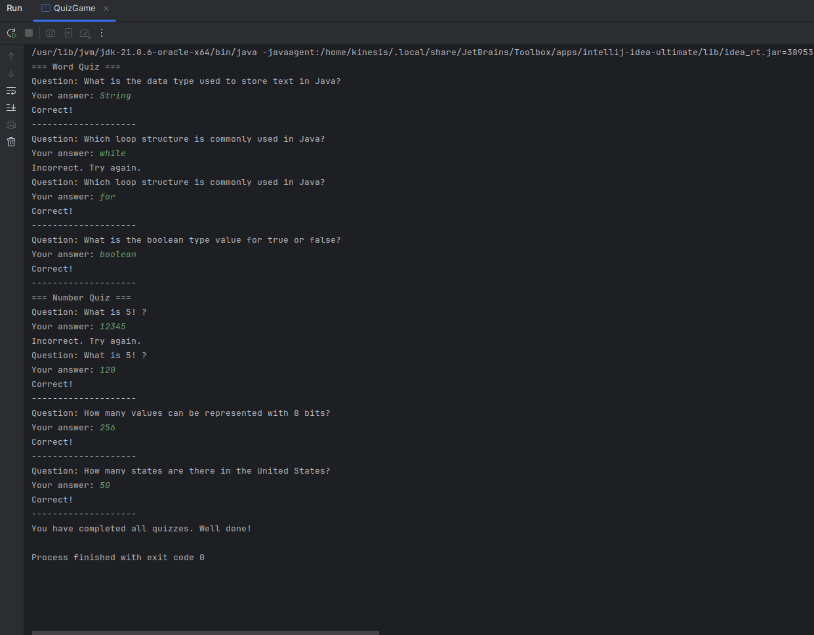

# Robotics - 2024405068 - Park Kihong(Kinesis Akashic)

repo: [Homework_2](https://github.com/kinesis19/Comprehend_Mobile_Robots/tree/main/Homework_2)

## Report

### Introduction
과제의 목적: Java의 클래스와 추상화 개념을 이용한 퀴즈 프로그램 구현하기.

### Implementation Details

#### Quiz Class
- 역할: 모든 퀴즈(WordQuiz, NumberQuiz)의 질문과 답변의 베이스를 담당하는 클래스.
- 특징: question 필드, askQuestion() 메서드, checkAnswer() 추상 메서드로 구성됨.

#### World Class
- 역할: Quiz를 상속받아 단어형 퀴즈를 담당하는 클래스.
- 특징: super()를 호출하여 정답을 초기화하고, checkAnswer()를 통해 문자열을 비교하여 정답을 검사함.

#### Number Class
- 역할: Quiz를 상속받아 숫자형 퀴즈를 담당하는 클래스.
- 특징: super()를 호출하여 정답을 초기화하고, checkAnswer()를 통해 문자열을 정수로 변환하여 정답을 검사함.

#### QuizGame Class
- 역할: 이번 과제의 Quiz 프로그램의 핵심을 담당하며, CLI을 통해 사용자에게 문제를 출력 및 값을 입력 받도록 하는 클래스.
- 특징: 반복문을 통해 정답을 맞출 때까지 사용자로부터 값을 입력받음.

## Result
